# Rock Paper Scissors Game
### Player vs. Computer
### About
Rock Paper Scissors is a hand game from China, usually played between two people. The game's purpose is to entertain players in a game where the opponent is a computer. This site is designed to entertain RPS fans. This includes the title, starting the game, moving left, the score board, player score points, computer score points, and final result.

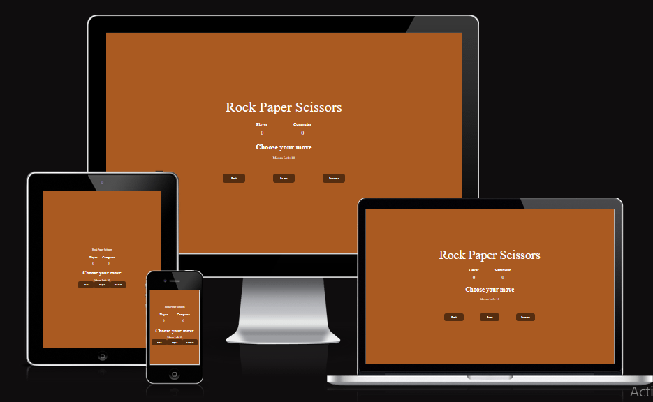
**Deployment**
This site was deployed to GitHub pages 
steps to deploy are as follows: 
- In the GitHub Repository, navigate to the setting tab 
- from the source section drop-down menu, select the Main Branch.
- Once the main branch has been selected, the page will be automatically refreshed with a detailed ribbon display to show the successful deployment.
- The live link can be found [here](https://asmahu.github.io/rock-scissor-paper-/)

**Responsiveness**
- Fully responsive design allows users to access from any device: Desktop, Tablet, or Mobile Phone.

**Features
- Pattern matching functionality 
- A limited number of tries before the game is over
- A score tracking system 
- The ability to play against the computer 

## Existing Features 
  ## Score Area
  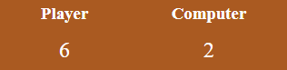
  ## Moves Left board
   
  ## Game controls area
   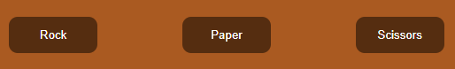
   ## Show reslult

   ## Replay
   

**Features left to implement**
- Welcome page/ rules
- In the future, the game will be expanded to have an introduction screen with a bigger group of fun and increasing    difficulty levels to entertain users.

## Code and assest
**HTML**
- All elements of the page were structured in code, as can be seen on the page
comments are added to describe details.

**CSS**
- CSS is structured as HTML in the same order to display
- comments are added to each element 
- At the end of the CSS file, media queries are added.

**JavaScript Code Structure**
- gameArea() function that contains three variables PlayScore, ComputerScore and moves that will keep the record of the Player's score, computer's score, and moves 
sequentially.

- playGame() function with three buttons
winner() function, which receives two arguments, one the player's input and another computer option, and will decide who wins between the computer and player
- gameOver() displays the final result with a replay button, and when moves become equal to 10, this function will be called.
## Wireframe
**This site has the same order of design on all devices.**
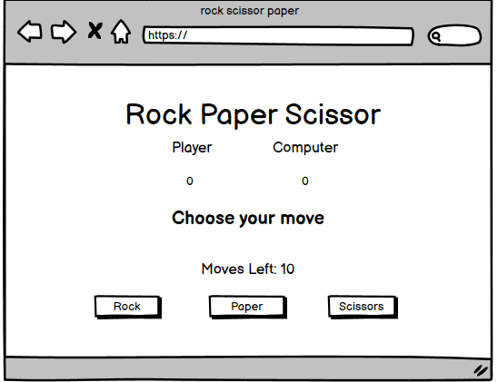  
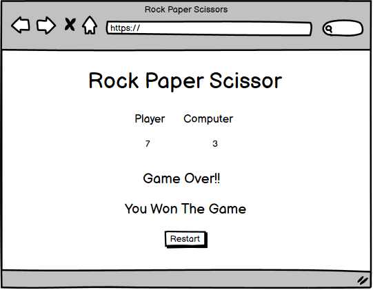 
 
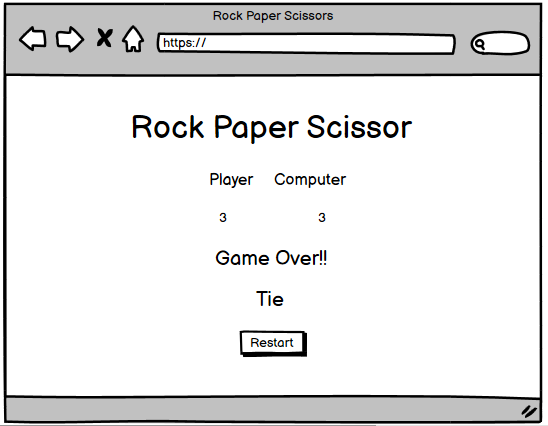 
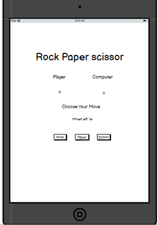 
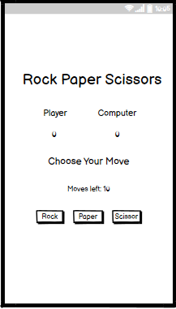

## Testing
**HTML**
- W3C validator  
- No errors were found 

**CSS**
- Jigsaw validator  
- No errors were found

**JS**
- Jshint.com
- No errors were found
- There are 9 functions in this file.
- Function with the largest signature take 2 arguments, while the median is 0.

- Largest function has 28 statements in it, while the median is 6.

- The most complex function has a cyclomatic complexity value of 8 while the median is 1.

## Performance
## Desktop Lighthouse Test
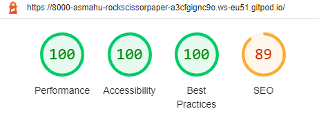
## Mobile Lighthouse Test
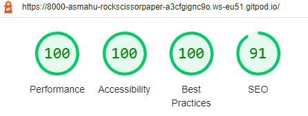

**Responsiveness**
- Tested in chrome Dev Tools, Firefox and Opera browser.

**Unfixed Errors**
- No

**Credits**
- I highly appreciate the slack community for helping me to solve any problems during this project.

**Content**
- I often look for help in the StackOverflow community when I get stuck.

**Media** 
- [Flexbox in 20 minutes](https://www.youtube.com/watch?v=JJSoEo8JSnc&t=30s) 
- [JavaScript in 3 hours](https://www.youtube.com/watch?v=PkZNo7MFNFg&t=8s)

## Languages
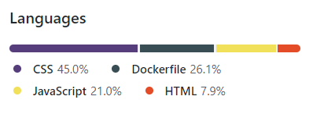
